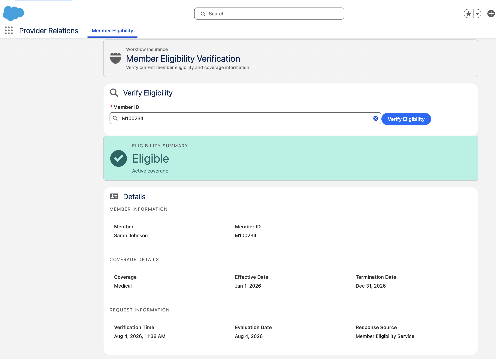
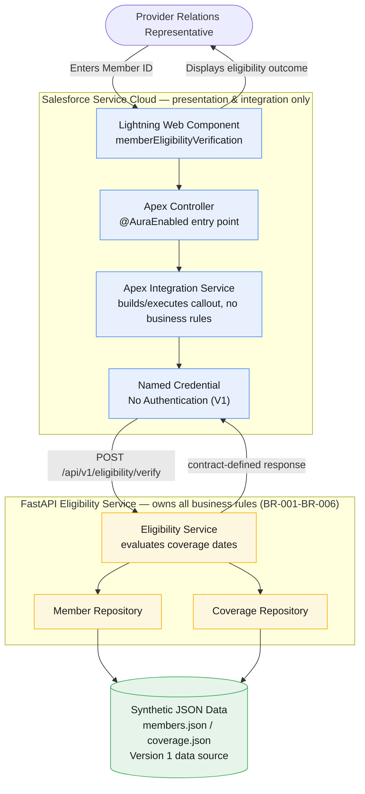

# Workflow Insurance

Production-inspired reference implementation demonstrating AI-assisted enterprise software engineering.



*Live end-to-end validation: Salesforce Lightning Web Component → Apex → Named Credential → FastAPI → eligibility result rendered in Salesforce.*

## Why This Repository Exists

Most AI coding demonstrations focus on a single act: generating code from a prompt. This repository demonstrates the complete engineering lifecycle around that code — the parts that determine whether generated software is trustworthy enough for an enterprise to run.

```text
Business Discovery → Requirements → Architecture → OpenAPI Contract →
Backend Engineering → Salesforce Integration → Testing → Live Validation →
Engineering Journal → Productization
```

Each stage produced a reviewable artifact before the next stage began. The objective is disciplined enterprise engineering, not code generation alone — AI accelerated every stage, but specifications, review, and validation gated what shipped.

## Business Problem

A Provider Relations representative receives a phone call from a healthcare provider asking whether a member currently has active coverage. Answering that question today typically means searching multiple systems, retrieving coverage information, and manually comparing effective and termination dates before responding. Each step is simple, but the process is repeated thousands of times, depends on institutional knowledge, and produces inconsistent decisions across representatives. (`docs/01-business-discovery.md`)

## Solution Overview

A representative enters a Member ID in Salesforce. Salesforce calls a reusable backend service, which retrieves member and coverage information, evaluates eligibility, and returns a standardized decision — **Eligible**, **Ineligible**, **Unable to Determine**, or a member-not-found error. Salesforce collects the Member ID and displays the result; it never evaluates eligibility itself. The backend owns that decision entirely, so it can be reused by future channels without duplicating business rules.

## Validation Summary

| Validation | Status |
|------------|--------|
| Ruff | ✅ Passed |
| Backend Tests | ✅ 19 Passing |
| OpenAPI Contract Alignment | ✅ Verified |
| Salesforce Deployment | ✅ Successful |
| Apex Tests | ✅ 12 Passing |
| LWC Jest Tests | ✅ 6 Passing |
| Live End-to-End Validation | ✅ Salesforce → Apex → FastAPI → Salesforce |

Sources: `engineering-journal/03-fastapi-generation.md` (Ruff, backend tests, contract alignment), `engineering-journal/04-salesforce-generation.md` (Salesforce deployment, Apex tests, LWC Jest tests), `engineering-journal/06-salesforce-ui-polish.md` (live end-to-end validation).

The live end-to-end row confirms one scenario — Member ID `M100234`, Eligible — traversing the real integration path into a deployed Salesforce org, through a Cloudflare Tunnel to a locally running FastAPI instance, and back into the Salesforce UI. It was a manual, one-time verification, not an automated or standing connection; the tunnel exists only for demonstration (see Current Scope). The other three outcomes are validated independently on each side of the integration but have not individually been exercised live end to end.

## Architecture

Salesforce is the presentation and integration layer. FastAPI owns every eligibility business rule. Data is synthetic JSON, not a database. No eligibility logic is duplicated in Salesforce. (`docs/06-end-to-end-architecture.md`)



*Source: `docs/06-end-to-end-architecture.md`, "High-Level Architecture." No architecture image assets exist under `showcase/assets/architecture/` in this repository, so the diagram above is embedded directly rather than linked.*

- **Lightning Web Component** — collects the Member ID, calls Apex, renders loading/success/error states
- **Apex** — `@AuraEnabled` controller plus integration service; builds the callout, translates failures, contains no business rules
- **Named Credential** — resolves the callout endpoint; no hardcoded URLs or secrets in Apex
- **FastAPI** — hosts the single `POST /api/v1/eligibility/verify` endpoint defined by the OpenAPI contract
- **Eligibility Service** — the sole owner of the eligibility decision, evaluating coverage dates against today
- **Synthetic Repository** — Member and Coverage repositories reading `members.json` / `coverage.json`, the Version 1 data source

## Technology Stack

| Layer | Technology |
|---|---|
| Frontend | Salesforce Lightning Web Components, Salesforce Lightning Design System |
| Backend | Python, FastAPI, Pydantic |
| API | OpenAPI 3.1, REST, JSON |
| Integration | Apex, Named Credentials |
| Testing | Pytest, Apex Tests, LWC Jest |
| Developer Experience | uv (Python), Salesforce CLI (`sf`), Claude Code |
| Infrastructure | JSON synthetic data (Version 1); Cloudflare Tunnel for demonstration only — no cloud deployment |

## AI-Assisted Engineering Lifecycle

```text
Business Discovery → Functional Requirements → Architecture → Implementation Design →
OpenAPI Contract → Backend Generation → Salesforce Integration → UI Refinement →
Testing → Live Validation → Engineering Journal → Productization
```

Every stage was human-reviewed. Reusable Claude skills (`.claude/skills/`) and project prompts (`prompts/`) drove generation at each step, but architecture decisions, specification conflicts, and deployment authorization were resolved by a person, not inferred by the AI. Each engineering journal (`engineering-journal/`) records what was generated, what was validated by real execution — not just inspection — and what defects real execution caught.

## Screenshots

No screenshot assets exist yet under `showcase/assets/screenshots/` in this repository. Expected captures, once added, are:

| Screenshot | Description |
|---|---|
| Salesforce Application | The Provider Relations app, showing the Member Eligibility page in the Salesforce navigation |
| Member Eligibility Verification | The Lightning Web Component displaying an Eligible result for Member ID `M100234` |
| Swagger UI | The FastAPI interactive docs at `/docs`, showing the `POST /api/v1/eligibility/verify` operation |
| End-to-End Architecture | The high-level architecture diagram (embedded above, from `docs/06-end-to-end-architecture.md`) |

## Repository Structure

```text
.
├── backend/               FastAPI service: app source, tests, synthetic JSON data
├── salesforce/            Lightning Web Component, Apex integration, config guides
├── contracts/             member-eligibility.yaml — the authoritative OpenAPI contract
├── docs/                  Business discovery, requirements, architecture, API design
├── showcase/              Case study, demo script, and related showcase materials
├── prompts/               Project prompts used to drive each generation step
├── engineering-journal/   Journals recording what was built, decided, and validated
└── .claude/               Reusable Claude skills used to generate this implementation
```

## Running Locally

The backend runs standalone; no Salesforce org is required to explore the API.

```bash
git clone <this-repository>
cd insurance-member-eligibility/backend
uv sync
uv run uvicorn app.main:app --reload
```

The API is served at `http://localhost:8000`; interactive docs (Swagger UI) are at `http://localhost:8000/docs`. Run the test suite with `uv run pytest`.

For Salesforce org deployment and configuration, see [`salesforce/README.md`](salesforce/README.md). For backend implementation details, see [`backend/README.md`](backend/README.md). Neither is duplicated here.

## Current Scope

Version 1 intentionally scopes to a single, well-validated capability:

- **Synthetic data.** `members.json` and `coverage.json` are reference data for this reference implementation, by design.
- **Local FastAPI.** The backend runs as a local process, matching a Version 1 built to prove the architecture, not to operate a production service.
- **Cloudflare Tunnel, used only for demonstration.** The one live end-to-end test reached the local FastAPI instance through a temporary tunnel — a deliberate choice to validate the integration without standing up hosting infrastructure ahead of a business need for one.
- **No production authentication.** The Named Credential is configured with No Authentication, matching the current contract's own scope, which states Version 1 "assumes trusted internal communication."
- **No cloud deployment.** Nothing in this repository is deployed to a persistent, publicly reachable environment.

These are scope decisions for a reference implementation, not deficiencies to be fixed before the architecture can be trusted.

## What This Repository Demonstrates

- **API-first, specification-driven development** — the OpenAPI contract was written before implementation and is the sole integration boundary between Salesforce and the backend.
- **Salesforce integration** — a thin Lightning Web Component and Apex layer that never duplicates backend business logic.
- **Backend engineering** — a FastAPI service with unit, integration, and contract-alignment tests.
- **Testing and validation** — linting, automated tests, a real Salesforce org deployment, and a live end-to-end verification, not just code generation.
- **AI-assisted engineering governance** — specifications, reusable skills, and engineering journals that keep AI-generated work auditable and reviewable.

## Related Documentation

- [End-to-End Architecture](docs/06-end-to-end-architecture.md)
- [Case Study](showcase/case-study.md)
- Engineering Journals — [FastAPI generation](engineering-journal/03-fastapi-generation.md), [Salesforce generation](engineering-journal/04-salesforce-generation.md), [architecture packaging](engineering-journal/05-architecture-packaging.md), [Salesforce UI polish](engineering-journal/06-salesforce-ui-polish.md)
- [OpenAPI Contract](contracts/member-eligibility.yaml)
- [Salesforce Documentation](salesforce/README.md)
- [Backend Documentation](backend/README.md)

## Roadmap

Future showcases are expected to expand the Workflow Insurance reference enterprise with additional capabilities, including:

- Claims Processing
- Prior Authorization
- Provider Search
- Member Benefits
- AI-assisted engineering workflows extended to additional enterprise platforms

No implementation timeline is committed for any of the above. (`showcase/case-study.md`, "What's Next"; `docs/01-business-discovery.md`, "Out of Scope")

## About WorkflowFox

WorkflowFox helps enterprises design, build, and modernize software using AI-assisted engineering. Salesforce organizations are the initial beachhead because of deep implementation expertise — not a boundary on what the methodology can do. The long-term focus is enterprise software engineering across platforms.
