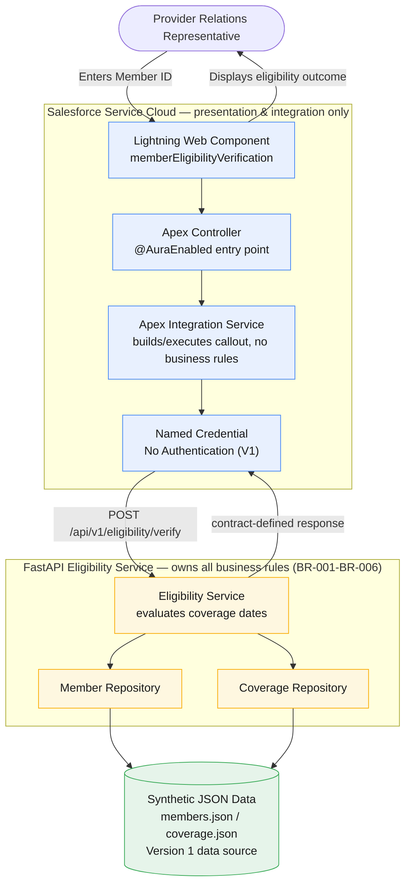
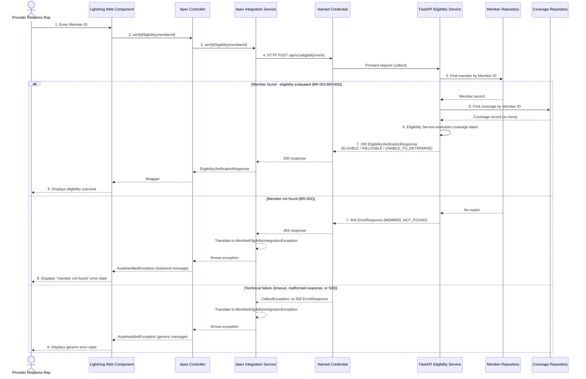

# End-to-End Architecture

## Purpose

This document explains the validated end-to-end architecture for the
Member Eligibility Verification reference implementation, after both the
FastAPI backend (`engineering-journal/03-fastapi-generation.md`) and the
Salesforce client (`engineering-journal/04-salesforce-generation.md`) were
generated and tested.

It consolidates `docs/01-business-discovery.md` through
`docs/05-api-design.md`, `contracts/member-eligibility.yaml`, and both
engineering journals into a single architecture reference: what was built,
how the pieces fit together, what has actually been proven to work, and
what has not. Where a claim in this document is a validation claim, it is
sourced from one of the two journals — nothing here is asserted as tested
unless a journal shows it was.

---

## Business Context

A Provider Relations representative receives a phone call from a
healthcare provider asking whether a member currently has active
coverage. Answering that question today requires the representative to
navigate multiple systems, retrieve coverage information, and manually
apply eligibility rules — a process that is slow, inconsistent across
representatives, and dependent on institutional knowledge
(`docs/01-business-discovery.md`, "Business Problem" and "Challenges").

Version 1 addresses exactly one capability: given a Member ID entered in
Salesforce, return a consistent eligibility decision — **Eligible**,
**Ineligible**, **Unable to Determine**, or a member-not-found outcome —
within seconds, without the representative leaving Salesforce
(`docs/01-business-discovery.md` "Scope"; `docs/02-functional-requirements.md`
FC-001–FC-005). Claims, benefits, deductibles, prior authorization,
provider search, multiple coverage records, and historical eligibility are
explicitly out of scope for this version.

---

## High-Level Architecture

Salesforce is the presentation and integration layer; it accepts the
Member ID and displays whatever the backend decided. The FastAPI service
owns every eligibility business rule and is the only component that
evaluates coverage dates. Version 1 data is synthetic JSON, not a
database. No eligibility logic is duplicated in Salesforce.

This mirrors the ASCII diagram in `docs/03-architecture.md` ("High-Level
Architecture") exactly, expanding Apex into its two real classes
(Controller and Integration Service) and the Member Eligibility Service
into its actual three components, as built.

---

## End-to-End Request Flow

The sequence below matches `docs/03-architecture.md` ("Request Flow",
steps 1–8) and shows how each of the four contract-defined outcomes
(`docs/02-functional-requirements.md` "Error Scenarios";
`contracts/member-eligibility.yaml`) is handled at each layer.

---

## Component Responsibilities

| Component | Responsibility | Does **not** do |
|---|---|---|
| Lightning Web Component (`memberEligibilityVerification`) | Collects Member ID, calls Apex, renders loading/success/empty-coverage/error states | Evaluate eligibility or interpret coverage dates |
| Apex Controller (`MemberEligibilityController`) | `@AuraEnabled` entry point; blank-`memberId` guard; translates integration failures into `AuraHandledException` | Build HTTP requests or contain business rules |
| Apex Integration Service (`MemberEligibilityIntegrationService`) | Builds/executes the callout, deserializes the response, translates HTTP/transport errors | Evaluate business outcomes — passes the contract's response through unchanged |
| Named Credential (`Member_Eligibility_Service`) | Resolves the callout endpoint; decouples Apex from the URL | Store hardcoded URLs, API keys, or tokens |
| Eligibility Service (FastAPI) | Retrieves member and coverage data, evaluates eligibility (BR-001–BR-006), produces the standardized response | Nothing — this is the sole owner of the business decision |
| Member Repository / Coverage Repository (FastAPI) | Retrieve member/coverage records from the data source | Apply eligibility rules |
| Synthetic JSON Data | Version 1 data source (`members.json`, `coverage.json`) | Persist writes, model claims/benefits/multiple coverage records |

Source: `docs/03-architecture.md` ("Component Responsibilities"),
`docs/04-implementation-design.md` ("Layer Responsibilities"),
`engineering-journal/04-salesforce-generation.md` ("Files Created").

---

## Security and Integration Boundary

- The OpenAPI contract (`contracts/member-eligibility.yaml`) is the sole
  integration boundary. Every Apex wrapper field, the callout path/method,
  and all four handled status codes (200/400/404/500) trace to it exactly
  — confirmed by both a static field-by-field review and a successful org
  deploy (see Validation Evidence).
- `docs/05-api-design.md` ("Security") states Version 1 "assumes trusted
  internal communication," and the contract defines no `security` or
  `securitySchemes`. The Named Credential (`Member_Eligibility_Service`)
  is configured with Authentication Protocol **No Authentication** —
  matching what the contract actually specifies, rather than inventing an
  OAuth, JWT, or API-key scheme the specifications don't describe
  (`engineering-journal/04-salesforce-generation.md`, "Architecture
  Decisions").
- No endpoint URL, API key, or token is hardcoded in Apex; every callout
  goes through the Named Credential
  (`salesforce/config/named-credential-guide.md`).
- A forward-looking (not-yet-required) guide for adding OAuth 2.0/JWT/mTLS
  once a future contract version defines an auth scheme exists at
  `salesforce/config/external-credential-guide.md`, explicitly labeled as
  not applicable to the current contract.

---

## Validation Evidence

Every result below is labeled by evidence type and sourced from one of
the two engineering journals. No claim here goes beyond what a journal
documents as actually executed.

### Component-level validation

| Component | Command | Result | Source |
|---|---|---|---|
| FastAPI — static analysis | `ruff check .` | **All checks passed!** | `engineering-journal/03-fastapi-generation.md` |
| FastAPI — automated tests | `pytest` | **19 passed** (6 unit, 7 integration, 6 contract-alignment) | `engineering-journal/03-fastapi-generation.md` |
| Salesforce — LWC unit tests | `sfdx-lwc-jest` (local, no org) | **6/6 passed**, 1 suite, ~0.5–1s | `engineering-journal/04-salesforce-generation.md` |

The FastAPI tests run entirely against the in-process app and synthetic
JSON data. The LWC tests run entirely against mocked Apex — no Salesforce
org and no FastAPI process were involved in either.

### Salesforce org validation

| Check | Command | Result | Source |
|---|---|---|---|
| Apex/LWC compilation | `sf project deploy start --source-dir force-app -o dev-workflowfox` | `"status": "Succeeded"`, `"numberComponentErrors": 0` — all 9 Apex classes + the LWC bundle deployed cleanly (after a `.forceignore` fix) | `engineering-journal/04-salesforce-generation.md` |
| Apex tests | `sf apex run test ... -o dev-workflowfox --code-coverage` | **12/12 passed, 100% pass rate, 100% coverage** on every class with executable logic | `engineering-journal/04-salesforce-generation.md` |

These Apex tests ran inside a real, connected Salesforce org
(`dev-workflowfox`) — but every callout in every test was intercepted by
`HttpCalloutMock`. No test in this suite made a real HTTP call to
anything, including FastAPI.

### Contract alignment

| Review | Method | Result | Source |
|---|---|---|---|
| Backend contract alignment | 6 automated `pytest` tests (`tests/contract/test_contract_alignment.py`) | Passing (included in the 19 above) | `engineering-journal/03-fastapi-generation.md` |
| Salesforce contract alignment | Manual field-by-field review (request/response/error schemas, all 4 status codes) | 7/7 rows matched | `engineering-journal/04-salesforce-generation.md` |

### End-to-end integration — **not validated**

No evidence in either journal shows the Salesforce client successfully
calling a running FastAPI deployment. Specifically:

- Every Apex test used `HttpCalloutMock` — the Named Credential and real
  network callout path have never been exercised.
- The FastAPI backend's own test suite never invoked Salesforce; it was
  only run locally via `pytest` (`engineering-journal/03-fastapi-generation.md`
  records no deployment step).
- No journal documents a live HTTP request from Salesforce reaching a
  running FastAPI process, nor a response from that process being
  displayed in a Salesforce UI.

**End-to-end runtime integration between Salesforce and FastAPI has not
been performed.** Each side has been validated independently against the
same contract; they have not yet been validated together.

---

## Architecture Decisions

| Decision | Reason | Source |
|---|---|---|
| Business rules live in the backend service, not Salesforce | Prevents duplication across Salesforce, web, mobile, and future integrations | `docs/03-architecture.md` AD-001 |
| Salesforce is the presentation layer | Allows UX changes without touching business logic | `docs/03-architecture.md` AD-002 |
| OpenAPI is defined before implementation | The contract becomes the shared agreement between Salesforce and backend development | `docs/03-architecture.md` AD-003 |
| Synthetic JSON data, not PostgreSQL, for Version 1 | Keeps the repository publicly shareable while demonstrating a realistic workflow; a relational database is deferred until a future requirement needs persistence | `docs/03-architecture.md` AD-004, "PostgreSQL" (Deferred) |
| Lightweight architecture for Version 1 | Demonstrates engineering methodology rather than infrastructure complexity | `docs/03-architecture.md` AD-005 |
| Single business endpoint (`POST /api/v1/eligibility/verify`) rather than CRUD | Consumers care about business outcomes, not database entities | `docs/05-api-design.md` APD-001 |
| Every Apex callout goes through a Named Credential | Prevents hardcoded endpoints/secrets and lets the same code run unchanged across environments | `docs/03-architecture.md` ("Technology Decisions"); `engineering-journal/04-salesforce-generation.md` |
| Named Credential configured with No Authentication | The contract defines no `security`/`securitySchemes`, and `docs/05-api-design.md` states V1 assumes trusted internal communication — no authentication mechanism was invented to fill that gap | `docs/05-api-design.md` ("Security"); `engineering-journal/04-salesforce-generation.md` |

---

## Current Limitations

Stated honestly, per what the journals do and do not show:

- **The FastAPI backend has not been deployed to a persistent HTTPS
  environment.** `engineering-journal/03-fastapi-generation.md` documents
  only local `ruff`/`pytest` execution; no deployment step or hosted URL
  is recorded anywhere in either journal. The contract's only documented
  server is `http://localhost:8000` ("Local development server").
- **A live Salesforce-to-FastAPI call has not been validated.** Every
  Apex test used `HttpCalloutMock`; no journal records a successful (or
  failed) real callout from the deployed Salesforce org to a running
  FastAPI instance.
- **Synthetic data only.** Both `members.json` and `coverage.json` are
  synthetic reference data, not a production data source
  (`docs/03-architecture.md` AD-004; `docs/01-business-discovery.md`
  "Out of Scope": PostgreSQL, production deployment).
- **Version 1 supports exactly one workflow** — eligibility verification
  by Member ID. Claims, benefits, copay calculations, deductibles, prior
  authorization, provider search, multiple coverage records, and
  historical eligibility are all explicitly out of scope
  (`docs/01-business-discovery.md`, `docs/02-functional-requirements.md`
  "Out of Scope").
- **No authentication is configured on the callout path.** This matches
  the current contract's own scope (see "Security and Integration
  Boundary") but is not a production-ready security posture on its own.

---

## Future Evolution

Consolidated from `docs/03-architecture.md` ("Future Evolution") and
`docs/05-api-design.md` ("Future Evolution"), plus the concrete gap
identified in "Current Limitations" above:

- Deploy the FastAPI backend to a persistent, reachable HTTPS environment
  and perform a genuine end-to-end validation — a live Salesforce callout
  reaching that deployment and a real response rendered in the LWC —
  before claiming end-to-end integration is proven.
- Introduce authentication (OAuth 2.0, JWT, or mutual TLS) once a future
  contract version defines a concrete scheme; `salesforce/config/external-credential-guide.md`
  already documents the Named Credential migration path for when that
  happens.
- Introduce PostgreSQL once a future requirement needs persistent storage
  beyond synthetic JSON files.
- Expand the API surface: Coverage Details, Benefits, Claims History,
  Prior Authorization, Provider Validation, Bulk Eligibility Verification.
- Introduce Docker/Kubernetes, an API Gateway, event-driven architecture,
  observability, and CI/CD automation as the reference implementation
  matures beyond a single-capability demonstration.
- Introduce AI-assisted decision support only once justified by an
  additional business requirement — not speculatively.

---

## Traceability

This document synthesizes, rather than replaces, the detailed
requirement-to-implementation traceability already recorded in each
generation journal:

- `engineering-journal/03-fastapi-generation.md` ("Traceability") — maps
  BR-001–BR-006 and the full contract to backend implementation files and
  tests.
- `engineering-journal/04-salesforce-generation.md` ("Traceability
  review") — maps FC-001, FC-005, the contract's request/response/error
  shapes, and the thin-Apex/thin-LWC boundary to Salesforce implementation
  files and tests.

| Specification artifact | Realized in | Validated by |
|---|---|---|
| `docs/01-business-discovery.md` (Scope) | End-to-end architecture (this document) | Manual review |
| `docs/02-functional-requirements.md` (FC-001–FC-005, BR-001–BR-006) | `backend/app/services/eligibility_service.py`; `salesforce/.../memberEligibilityVerification` | Backend: 19 pytest; Salesforce: 12 Apex tests + 6 LWC tests |
| `docs/03-architecture.md` (component boundaries, AD-001–AD-005) | Backend + Salesforce component split (see "Component Responsibilities") | Manual review; org deploy success |
| `docs/04-implementation-design.md` (domain model, layering) | `backend/app/models`, `backend/app/repositories`, `backend/app/services` | Backend unit + integration tests |
| `docs/05-api-design.md` (resource, status codes, security) | `contracts/member-eligibility.yaml`; `MemberEligibilityIntegrationService` | Contract-alignment tests (both sides) |
| `contracts/member-eligibility.yaml` | Backend API layer; Apex wrapper classes | 6 backend contract-alignment tests; Salesforce static field-by-field review |
| End-to-end runtime integration | *Not yet realized* | *Not yet validated — see Validation Evidence* |
