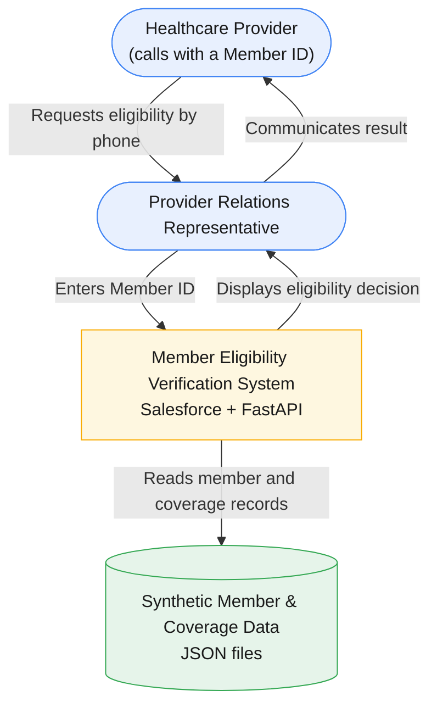

# System Context Diagram

## Purpose

This diagram shows the Member Eligibility Verification system at the business level: who uses it, what system it is, and what it depends on. It intentionally omits internal components (Lightning Web Component, Apex classes, FastAPI services) — those are documented in [`docs/06-end-to-end-architecture.md`](../../docs/06-end-to-end-architecture.md) ("High-Level Architecture").

## Scope

A Provider Relations representative receives a phone call from a healthcare provider asking whether a member currently has active coverage. The representative enters a Member ID into Salesforce and receives a standardized eligibility decision — **Eligible**, **Ineligible**, **Unable to Determine**, or a member-not-found result — without leaving Salesforce or consulting other systems. (`docs/01-business-discovery.md`, "Business Context" and "Scope")

## Diagram

## Actors and Systems

| Element | Type | Description |
|---|---|---|
| Healthcare Provider | External actor | Calls Provider Relations to ask whether a member currently has active coverage. Supplies a Member ID. (`docs/01-business-discovery.md`, "Business Context") |
| Provider Relations Representative | User | Enters the Member ID into Salesforce, receives the eligibility decision, and communicates it back to the provider. (`docs/01-business-discovery.md`, "Business Context") |
| Member Eligibility Verification System | System in scope | Salesforce (presentation and integration) plus the FastAPI backend (business logic). Accepts a Member ID and returns a standardized eligibility decision. (`docs/03-architecture.md`, "High-Level Architecture"; `docs/06-end-to-end-architecture.md`, "High-Level Architecture") |
| Synthetic Member & Coverage Data | External data source | `members.json` and `coverage.json` — the Version 1 data source. Not a production system of record. (`docs/03-architecture.md`, AD-004; `docs/01-business-discovery.md`, "Out of Scope") |

## Notes

- Version 1 supports exactly one business capability: eligibility verification by Member ID. Claims, benefits, deductibles, prior authorization, provider search, multiple coverage records, and historical eligibility are out of scope. (`docs/01-business-discovery.md`, "Out of Scope")
- The system boundary shown here groups Salesforce and the FastAPI backend together because, from the representative's and provider's perspective, they interact with a single capability. Internal separation of responsibilities between Salesforce and FastAPI is documented in [`docs/03-architecture.md`](../../docs/03-architecture.md) and [`docs/06-end-to-end-architecture.md`](../../docs/06-end-to-end-architecture.md).
- The one live end-to-end validation used Member ID `M100234` and returned an Eligible result; it relied on a temporary Cloudflare Tunnel for demonstration purposes, not a persistent deployment. (`engineering-journal/06-salesforce-ui-polish.md`, "Live End-to-End Validation"; `showcase/case-study.md` is silent on this specific detail — sourced from the journal and `README.md`, "Current Scope")

## Traceability

| Source | Used for |
|---|---|
| `docs/01-business-discovery.md` | Actors, business context, scope, out-of-scope items |
| `docs/03-architecture.md` | System boundary, component grouping |
| `docs/06-end-to-end-architecture.md` | High-level architecture, data source description |
| `showcase/case-study.md` | Business problem framing |
| `engineering-journal/06-salesforce-ui-polish.md` | Live end-to-end validation detail |
| root `README.md` | Current scope (synthetic data, no cloud deployment) |
