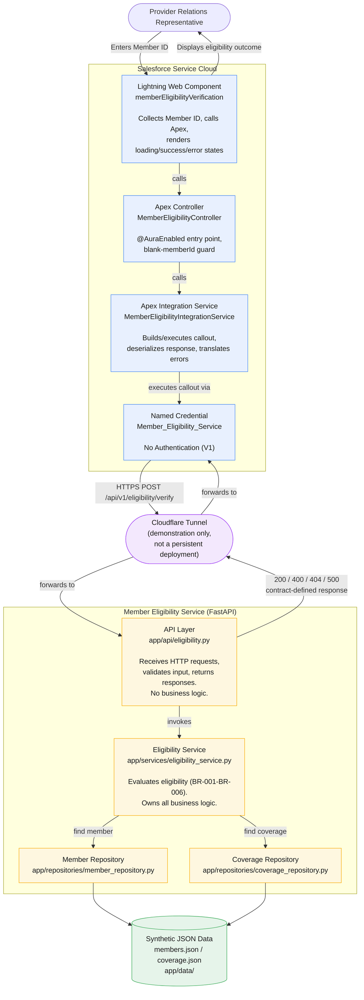

# Container Diagram

## Purpose

This diagram zooms into the single system shown in [`01-system-context.md`](01-system-context.md) and shows its containers — the separately runnable/deployable units — and how they communicate. It stops at the container level; individual classes and files (e.g. `MemberEligibilityController`, `eligibility_service.py`) are documented in [`docs/06-end-to-end-architecture.md`](../../docs/06-end-to-end-architecture.md) ("Component Responsibilities") and the engineering journals.

## Scope

Following `docs/03-architecture.md` ("High-Level Architecture") and `docs/06-end-to-end-architecture.md` ("High-Level Architecture"), the system in scope decomposes into two runtime containers plus the data they depend on:

- **Salesforce Service Cloud** — presentation and integration only; contains no eligibility business rules (`docs/03-architecture.md`, "Component Responsibilities" — "Salesforce does **not** evaluate eligibility").
- **Member Eligibility Service (FastAPI)** — owns every eligibility business rule (`docs/06-end-to-end-architecture.md`, "High-Level Architecture" — "owns all business rules (BR-001-BR-006)").

Both containers are validated independently but the connection between them, in a persistent deployed form, is not (see "Validation Status" below).

## Diagram

## Containers

| Container | Technology | Responsibility | Does **not** do | Source |
|---|---|---|---|---|
| Lightning Web Component (`memberEligibilityVerification`) | LWC (JS/HTML/CSS) | Collects Member ID, calls Apex, renders loading/success/empty-coverage/error states | Evaluate eligibility or interpret coverage dates | `docs/06-end-to-end-architecture.md`, "Component Responsibilities" |
| Apex Controller (`MemberEligibilityController`) | Apex | `@AuraEnabled` entry point; blank-`memberId` guard; translates integration failures into `AuraHandledException` | Build HTTP requests or contain business rules | `docs/06-end-to-end-architecture.md`, "Component Responsibilities" |
| Apex Integration Service (`MemberEligibilityIntegrationService`) | Apex | Builds/executes the callout, deserializes the response, translates HTTP/transport errors | Evaluate business outcomes — passes the contract's response through unchanged | `docs/06-end-to-end-architecture.md`, "Component Responsibilities" |
| Named Credential (`Member_Eligibility_Service`) | Salesforce platform config, No Authentication | Resolves the callout endpoint; decouples Apex from the URL | Store hardcoded URLs, API keys, or tokens | `docs/06-end-to-end-architecture.md`; `engineering-journal/04-salesforce-generation.md`, "Architecture Decisions" |
| API Layer (`app/api/eligibility.py`) | FastAPI | Receives HTTP requests, validates request data, invokes business services, returns standardized responses | Contain business logic | `docs/04-implementation-design.md`, "Layer Responsibilities" |
| Eligibility Service (`app/services/eligibility_service.py`) | Python | Retrieves member and coverage data, evaluates eligibility (BR-001–BR-006), produces the standardized response | Nothing — sole owner of the business decision | `docs/06-end-to-end-architecture.md`, "Component Responsibilities" |
| Member Repository / Coverage Repository | Python | Retrieve member/coverage records from the data source | Apply eligibility rules | `docs/04-implementation-design.md`, "Layer Responsibilities" |
| Synthetic JSON Data (`members.json`, `coverage.json`) | JSON files | Version 1 data source | Persist writes; model claims/benefits/multiple coverage records | `docs/03-architecture.md`, AD-004 |
| Cloudflare Tunnel | Cloudflare Tunnel | Exposed the locally running FastAPI instance to the deployed Salesforce org for one manual, one-time demonstration | Provide a standing or production connection | `engineering-journal/06-salesforce-ui-polish.md`, "Live End-to-End Validation"; root `README.md`, "Current Scope" |

## Communication

- **LWC → Apex Controller → Apex Integration Service**: in-process Apex calls within Salesforce. (`docs/06-end-to-end-architecture.md`, "High-Level Architecture")
- **Apex Integration Service → Named Credential → FastAPI**: `POST /api/v1/eligibility/verify` over HTTPS, per `contracts/member-eligibility.yaml`. The Named Credential resolves the endpoint so no URL or secret is hardcoded in Apex. (`docs/06-end-to-end-architecture.md`, "Security and Integration Boundary")
- **Request/response shape**: exactly what `contracts/member-eligibility.yaml` defines — `EligibilityVerificationRequest` in, `EligibilityVerificationResponse` (200) or `ErrorResponse`/`ValidationErrorResponse` (400/404/500) out. Every Apex wrapper field, the callout path/method, and all four status codes trace to the contract exactly. (`docs/06-end-to-end-architecture.md`, "Security and Integration Boundary")
- **API Layer → Eligibility Service → repositories → JSON data**: in-process Python calls within the FastAPI service. (`docs/04-implementation-design.md`, "Layer Responsibilities")
- **Named Credential base URL**: configured as a placeholder (`http://localhost:8000`, the contract's documented local development server) and must be replaced with a deployed backend's HTTPS URL before non-local use. (`engineering-journal/04-salesforce-generation.md`, "Assumptions")

## Validation Status

Each container has been validated independently; the connection between them has been proven exactly once, manually, not as a standing integration:

| Check | Result | Source |
|---|---|---|
| FastAPI static analysis (`ruff check .`) | All checks passed | `engineering-journal/03-fastapi-generation.md` |
| FastAPI automated tests (`pytest`) | 19 passed (6 unit, 7 integration, 6 contract-alignment) | `engineering-journal/03-fastapi-generation.md` |
| Apex compilation/deploy (`sf project deploy start`) | Succeeded, 0 component errors, 9 Apex classes + LWC bundle | `engineering-journal/04-salesforce-generation.md` |
| Apex tests (`sf apex run test`) | 12/12 passed, 100% coverage on every class with executable logic | `engineering-journal/04-salesforce-generation.md` |
| LWC Jest tests | 6/6 passed | `engineering-journal/04-salesforce-generation.md` |
| Live end-to-end call (Salesforce → Cloudflare Tunnel → FastAPI → Salesforce) | One successful manual run, Member ID `M100234`, result Eligible | `engineering-journal/06-salesforce-ui-polish.md`, "Live End-to-End Validation" |

Every Apex test used `HttpCalloutMock`, not a real callout — the one real callout path (Named Credential → Cloudflare Tunnel → FastAPI) was exercised only in the single live validation above, not by any automated test. (`docs/06-end-to-end-architecture.md`, "Validation Evidence" — "End-to-end integration — not validated" as a standing/automated property; the one manual exception is documented in `engineering-journal/06-salesforce-ui-polish.md`.)

## Notes

- No container in this diagram evaluates eligibility except the Eligibility Service — this boundary is enforced by design (`docs/03-architecture.md`, AD-001) and confirmed by manual review that no date/coverage comparison logic exists anywhere in `salesforce/` (`engineering-journal/04-salesforce-generation.md`, "OpenAPI alignment review").
- The Cloudflare Tunnel is not part of the permanent architecture. It existed only to demonstrate the integration once and is expected to be replaced by a persistent HTTPS deployment in a future version. (`README.md`, "Current Scope"; `docs/06-end-to-end-architecture.md`, "Future Evolution")
- No authentication is configured between the Named Credential and FastAPI. This matches the current OpenAPI contract, which defines no `security`/`securitySchemes`, and `docs/05-api-design.md`'s statement that Version 1 "assumes trusted internal communication." (`docs/06-end-to-end-architecture.md`, "Security and Integration Boundary")

## Traceability

| Source | Used for |
|---|---|
| `docs/03-architecture.md` | Container boundaries, component responsibilities, technology decisions |
| `docs/04-implementation-design.md` | FastAPI layer responsibilities (API/Service/Repository/Data) |
| `docs/05-api-design.md` | Request/response resource shape, security posture |
| `docs/06-end-to-end-architecture.md` | Container diagram baseline, component responsibility table, validation evidence, security boundary |
| `contracts/member-eligibility.yaml` | Endpoint, request/response schemas, status codes |
| `engineering-journal/03-fastapi-generation.md` | Backend validation results (ruff, pytest) |
| `engineering-journal/04-salesforce-generation.md` | Salesforce container/class inventory, deploy and test validation results, Named Credential decision |
| `engineering-journal/06-salesforce-ui-polish.md` | Live end-to-end validation (Cloudflare Tunnel path, Member ID `M100234` result) |
| `showcase/architecture/01-system-context.md` | Parent system boundary this diagram decomposes |
| root `README.md` | Current scope (Cloudflare Tunnel for demonstration only, no cloud deployment) |
