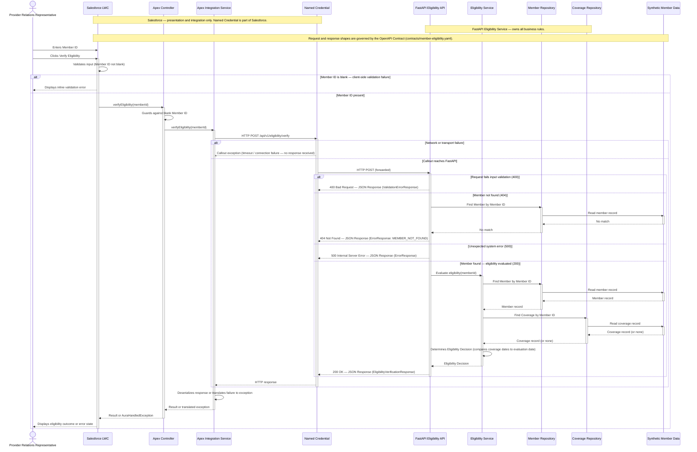

# Sequence Diagram

## Purpose

This diagram shows the runtime request flow for the Member Eligibility Verification capability: exactly what happens after a Provider Relations Representative presses **Verify Eligibility**, across every container introduced in [`02-container-diagram.md`](02-container-diagram.md), down to the point where a result is displayed back to the representative.

It is scoped to the single validated capability — `POST /api/v1/eligibility/verify` — and to the runtime path only. It does not describe deployment infrastructure, build tooling, or how the implementation was generated or tested; those are covered by [`docs/06-end-to-end-architecture.md`](../../docs/06-end-to-end-architecture.md) and the engineering journals.

## Runtime Flow

1. The representative enters a Member ID and clicks **Verify Eligibility**.
2. The Salesforce LWC validates the input is not blank before calling Apex.
3. The LWC calls the Apex Controller.
4. The Apex Controller invokes the Apex Integration Service.
5. The Integration Service sends an HTTP POST through the Named Credential.
6. The FastAPI Eligibility API receives the request.
7. The Eligibility Service evaluates the request.
8. The Eligibility Service requests the Member from the Member Repository.
9. The Member Repository retrieves the Member from Synthetic Member Data.
10. The Eligibility Service requests Coverage from the Coverage Repository.
11. The Coverage Repository retrieves Coverage from Synthetic Member Data.
12. The Eligibility Service determines the Eligibility Decision.
13. FastAPI returns a standardized JSON response.
14. The response returns through the Named Credential, the Apex Integration Service, and the Apex Controller to the LWC.
15. The representative sees the Eligibility Result.

Source: `docs/06-end-to-end-architecture.md`, "End-to-End Request Flow" and "High-Level Architecture."

## Mermaid Diagram

## Request

The only request shape in this flow is `EligibilityVerificationRequest`, carried in the HTTP POST body to `POST /api/v1/eligibility/verify`:

| Field | Type | Required | Description |
|---|---|---|---|
| `memberId` | string (min length 1) | Yes | Member identifier supplied by the provider |

Source: `contracts/member-eligibility.yaml`, `components.schemas.EligibilityVerificationRequest`.

## Response

On success (200), FastAPI returns `EligibilityVerificationResponse`:

| Field | Description |
|---|---|
| `memberId` | Member identifier |
| `memberName` | Full name of the member |
| `eligibilityStatus` | `ELIGIBLE`, `INELIGIBLE`, or `UNABLE_TO_DETERMINE` |
| `reason` | Human-readable explanation |
| `evaluationDate` | Date eligibility was evaluated |
| `coverageType` | Nullable — null when `UNABLE_TO_DETERMINE` |
| `effectiveDate` | Nullable — null when `UNABLE_TO_DETERMINE` |
| `terminationDate` | Nullable — null when `UNABLE_TO_DETERMINE` |

On 400, 404, or 500, FastAPI returns `ErrorResponse` (400 uses `ValidationErrorResponse`, structurally identical): `code`, `message`, `timestamp`, `correlationId`.

A member that cannot be found produces an HTTP 404 error response, not an `eligibilityStatus` value — there is no "Member Not Found" status in the response enum.

Source: `contracts/member-eligibility.yaml`, `components.schemas.EligibilityVerificationResponse`, `EligibilityStatus`, `ErrorResponse`, `ValidationErrorResponse`.

## Error Handling

| Scenario | Where it is handled | What happens |
|---|---|---|
| **Validation failure** (blank Member ID) | Salesforce LWC, before any Apex call | The LWC's own input validation blocks submission and shows an inline error; no callout is made. The Apex Controller applies the same guard again as a second check before invoking the Integration Service. |
| **400 — Invalid request** | FastAPI, if an invalid request still reaches the API | FastAPI returns `ValidationErrorResponse` (`code`, `message`, `timestamp`, `correlationId`). The Integration Service translates this into an exception the Apex Controller turns into an `AuraHandledException` for the LWC. |
| **404 — Member not found** | FastAPI, after a Member Repository lookup finds no match | FastAPI returns `ErrorResponse` with `code: MEMBER_NOT_FOUND`. The Integration Service translates this into `MemberEligibilityIntegrationException`; the Controller surfaces it to the LWC as an `AuraHandledException`, and the LWC shows a "member not found" error state. |
| **500 — Unexpected system error** | FastAPI, on an unhandled failure while evaluating eligibility | FastAPI returns `ErrorResponse` with `code: INTERNAL_SERVER_ERROR`. Handled the same way as 404 by Apex — translated to an exception, surfaced as a generic error state in the LWC. |
| **Network failure** | Apex Integration Service, if the callout itself fails (timeout, connection failure) | No HTTP response is received from FastAPI at all. The Integration Service catches the callout exception and translates it into `MemberEligibilityIntegrationException`, which the Controller turns into a generic `AuraHandledException` for the LWC. |

Source: `docs/06-end-to-end-architecture.md`, "End-to-End Request Flow" and "Component Responsibilities"; `contracts/member-eligibility.yaml`, `paths./api/v1/eligibility/verify.post.responses`.

## Business Logic Boundary

**Salesforce owns:**

- UI — collecting the Member ID and rendering loading/success/error states.
- Input validation — the LWC's blank-Member-ID check and the Apex Controller's blank-Member-ID guard.
- REST invocation — building and executing the HTTP callout through the Named Credential, and deserializing the response.

**Salesforce does not evaluate eligibility.** No date comparison, coverage-window logic, or eligibility decision exists anywhere in Salesforce; every outcome it displays is a value the backend already computed.

**FastAPI owns:**

- Eligibility rules — comparing coverage effective and termination dates to the evaluation date (BR-001–BR-006).
- Decision making — producing the `ELIGIBLE` / `INELIGIBLE` / `UNABLE_TO_DETERMINE` outcome, or the 404 member-not-found result.
- Data retrieval — the Member Repository and Coverage Repository are the only components that read Synthetic Member Data.

Source: `docs/06-end-to-end-architecture.md`, "High-Level Architecture" ("The FastAPI service owns every eligibility business rule and is the only component that evaluates coverage dates... No eligibility logic is duplicated in Salesforce") and "Component Responsibilities."

## Key Takeaway

Every step a representative experiences after clicking **Verify Eligibility** is either Salesforce collecting input and displaying a result, or FastAPI making the eligibility decision — there is exactly one place in this entire flow where the eligibility outcome is decided, and it is not in Salesforce.
