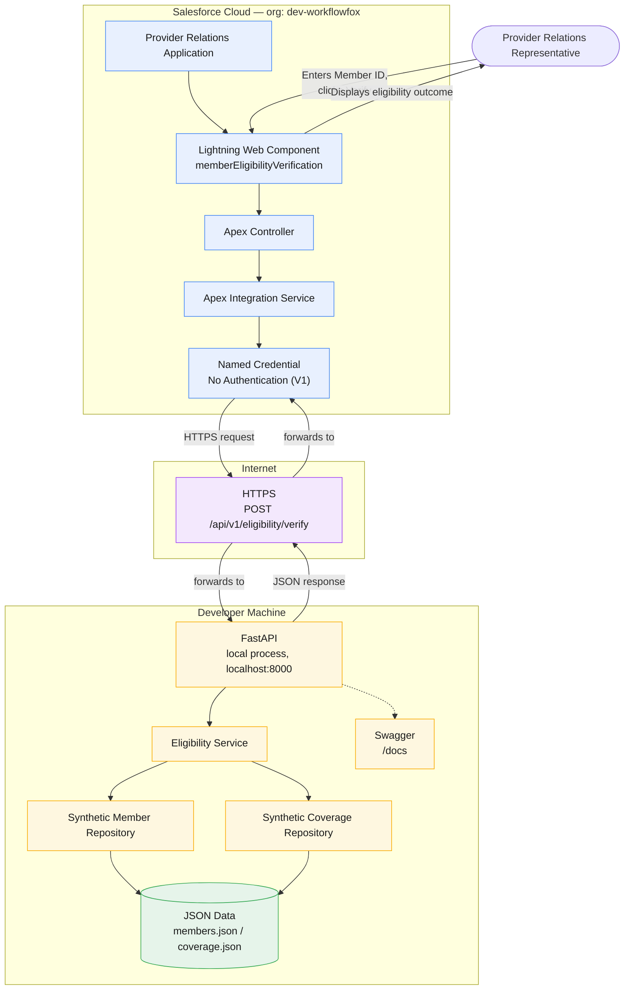

# Deployment Diagram

## Purpose

This diagram shows where every runtime component from [`02-container-diagram.md`](02-container-diagram.md) actually executes, for the Member Eligibility Verification capability as it was built and validated in Version 1. It is a deployment view, not a repeat of the container or sequence diagrams: those show what talks to what and in what order; this shows which machine, cloud, or network boundary each component runs on.

It represents only the deployment that was actually exercised during the live end-to-end validation — a Salesforce production/developer org calling a FastAPI process running on a developer's local machine. It does not represent a target production deployment, because Version 1 has none. (`README.md`, "Current Scope" — "No cloud deployment. Nothing in this repository is deployed to a persistent, publicly reachable environment.")

## Runtime Environment

Three deployment boundaries are represented:

### Salesforce Cloud

A Salesforce org (`dev-workflowfox`) hosting:

- Provider Relations Application (Lightning Application)
- Lightning Web Component (`memberEligibilityVerification`)
- Apex Controller
- Apex Integration Service
- Named Credential

Source: `engineering-journal/04-salesforce-generation.md` ("Validation Results" — org alias `dev-workflowfox`); `engineering-journal/06-salesforce-ui-polish.md` ("Salesforce Deployment" — deployed to `dev-workflowfox`; "Lightning Application" renamed to Provider Relations).

### Internet

HTTPS communication between the Salesforce org and the developer machine. No intermediary infrastructure is represented here beyond the network path itself — the actual live validation used a Cloudflare Tunnel to make the local FastAPI process reachable, but that tunnel was demonstration-only scaffolding, not part of the architecture, so this diagram represents the connection simply as HTTPS. (`engineering-journal/06-salesforce-ui-polish.md`, "Assumptions" — "Cloudflare Tunnel is temporary"; `README.md`, "Current Scope" — "Cloudflare Tunnel, used only for demonstration.")

### Developer Machine

A local process running:

- FastAPI (the Member Eligibility Service application)
- Eligibility Service
- Synthetic Member Repository
- Synthetic Coverage Repository
- JSON Data (`members.json`, `coverage.json`)
- Swagger (FastAPI's interactive API documentation)

Source: `docs/06-end-to-end-architecture.md`, "Current Limitations" — "The FastAPI backend has not been deployed to a persistent HTTPS environment... The contract's only documented server is `http://localhost:8000`"; `README.md`, "Running Locally" — `uv run uvicorn app.main:app --reload`, Swagger UI at `http://localhost:8000/docs`.

## Mermaid Diagram

## Deployment Responsibilities

| Runtime | Responsibility |
|---|---|
| Salesforce Cloud | Hosts the Provider Relations Application, the Lightning Web Component, the Apex Controller and Integration Service, and the Named Credential. Provides the representative-facing UI and initiates the callout. Deployed to and validated against org `dev-workflowfox`. |
| Internet | Carries the HTTPS request from the Named Credential to the FastAPI process and the JSON response back. No intermediary infrastructure is represented. |
| Developer Machine | Runs the FastAPI application, the Eligibility Service, the Member and Coverage Repositories, and the synthetic JSON data files. Also serves Swagger UI for interactive API exploration. This is the sole runtime location of every eligibility business rule. |

## Deployment Assumptions

- The Named Credential's base URL is a placeholder (`http://localhost:8000`, the contract's documented local development server) and must be replaced before any non-local use. (`engineering-journal/04-salesforce-generation.md`, "Assumptions")
- FastAPI runs as a local, developer-started process (`uv run uvicorn app.main:app --reload`), not as a managed or persistent service. (`README.md`, "Running Locally")
- The one live end-to-end validation reached this local FastAPI process from the deployed Salesforce org through a temporary Cloudflare Tunnel; this diagram represents that path generically as HTTPS, per the task's exclusion of tunnel-specific infrastructure. (`engineering-journal/06-salesforce-ui-polish.md`, "Live End-to-End Validation")
- No authentication is configured on the callout path; the Named Credential uses the "No Authentication" protocol, matching the OpenAPI contract's own scope. (`docs/06-end-to-end-architecture.md`, "Security and Integration Boundary")
- Synthetic data (`members.json`, `coverage.json`) is the only data source; there is no database in this deployment. (`docs/03-architecture.md`, AD-004)

## Version 1 Scope

This deployment diagram represents exactly what was built and validated, and nothing else:

- One Salesforce org (`dev-workflowfox`) — no additional environments (staging, production) exist.
- One local FastAPI process on a developer machine — no cloud hosting, container platform, or orchestration.
- Synthetic JSON data files — no database of any kind.
- HTTPS as the transport between Salesforce and FastAPI — no API gateway, load balancer, or CDN.
- No authentication on the callout path.
- No monitoring, logging aggregation, or observability infrastructure beyond what FastAPI and Salesforce provide natively.

Source: `docs/01-business-discovery.md`, "Out of Scope" ("Production deployment"); `README.md`, "Current Scope."

## Future Evolution

The following are explicitly **not** part of this deployment and do **not** appear in the diagram above. They are documented here only as known future direction, not as current architecture:

- Production cloud deployment of the FastAPI backend to a persistent, publicly reachable HTTPS environment.
- Authentication on the Salesforce-to-FastAPI callout path (OAuth 2.0, JWT, or mutual TLS).
- A managed/persistent database (e.g., PostgreSQL) replacing the synthetic JSON files.
- Observability (logging aggregation, metrics, tracing, monitoring).
- A container platform (Docker, Kubernetes) or infrastructure-as-code tooling.

Source: `docs/03-architecture.md`, "Future Evolution"; `docs/06-end-to-end-architecture.md`, "Future Evolution"; `README.md`, "Current Scope."

## Key Takeaway

Version 1's deployment is intentionally minimal: one Salesforce org, one developer machine running FastAPI over plain HTTPS, and synthetic JSON files — no cloud infrastructure, no database, and no authentication exist yet. This is a deliberate scope boundary for a reference implementation proving the architecture, not a gap to be closed before the architecture can be trusted.
