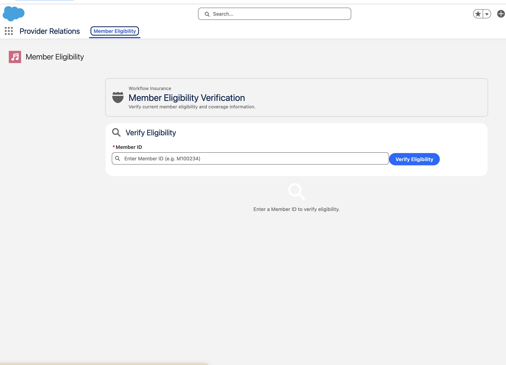
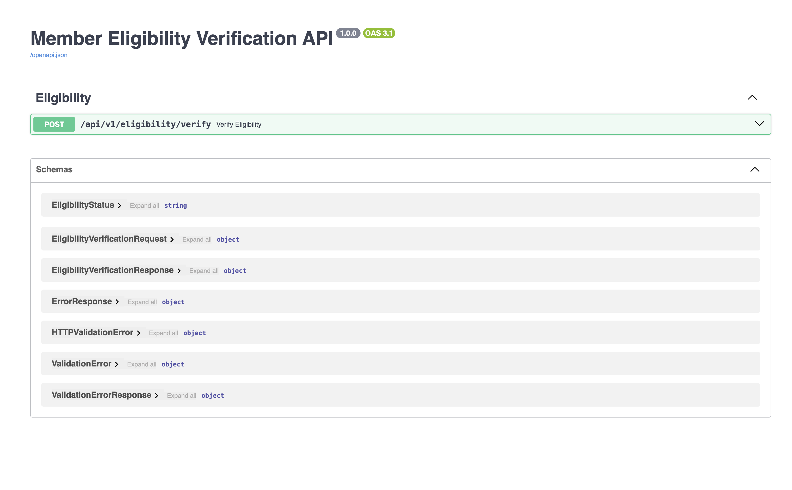
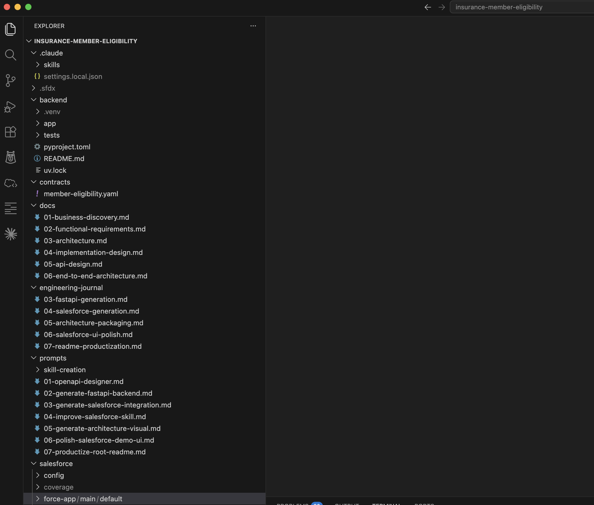

# AI-Assisted Member Eligibility Verification

## Hero

A production-inspired reference implementation demonstrating how WorkflowFox applies AI-assisted engineering to design, build, validate, and document enterprise software.

This showcase demonstrates an end-to-end Member Eligibility Verification solution spanning Salesforce Lightning Experience, FastAPI, and an OpenAPI-first integration contract.

**Highlights**

- End-to-end validated
- Salesforce + FastAPI integration
- OpenAPI-first architecture
- AI-assisted engineering
- Architecture-first design
- Complete engineering documentation

---

## The Business Challenge

Healthcare provider representatives frequently need to determine whether a member is eligible for coverage before scheduling services or approving treatment.

Traditional workflows often require navigating multiple systems, interpreting coverage information, and manually combining results before reaching a decision. These processes become increasingly difficult to maintain as systems and business rules evolve.

WorkflowFox created this reference implementation to demonstrate how enterprise software can simplify this workflow while following disciplined engineering practices.

---

## The Solution

The application provides a streamlined eligibility verification experience directly within Salesforce.

Provider Relations representatives enter a Member ID, submit the request, and receive a clear eligibility decision returned by a FastAPI backend through a contract-first REST API.

The implementation intentionally separates:

- User Experience
- Integration
- Business Logic
- Data Access

allowing each layer to evolve independently.

---

## Architecture Snapshot

**Business Flow**

Provider Relations Representative

↓

Salesforce Lightning

↓

OpenAPI Contract

↓

FastAPI Eligibility Service

↓

Synthetic Member & Coverage Data

↓

Eligibility Decision

↓

Salesforce Lightning

---

## Engineering Highlights

This showcase demonstrates:

- Business-first solution design
- Architecture-first engineering
- OpenAPI-first integration
- Salesforce Lightning Web Components
- FastAPI backend services
- Contract-driven development
- End-to-end validation
- Engineering journals
- Reusable architecture documentation

---

## Technology Stack

| Layer | Technology |
|--------|------------|
| Frontend | Salesforce Lightning Experience |
| UI | Lightning Web Components |
| Backend | FastAPI |
| API | OpenAPI 3.1 |
| Language | Python |
| Salesforce | Apex |
| Data | Synthetic JSON |
| Documentation | Markdown + Mermaid |
| AI Engineering | Claude Code + ChatGPT |

---

## Project Gallery

### Salesforce Experience

Provider Relations representatives verify member eligibility directly within Salesforce.

### Live Eligibility Verification

The application returns an eligibility decision using the FastAPI backend through the OpenAPI-defined integration.

### API Documentation

The backend is designed using an OpenAPI-first approach.

### Engineering Repository

The repository includes implementation, architecture, documentation, prompts, and engineering journals.

---

## Explore the Project

- GitHub Repository
- Case Study
- Architecture Documentation
- Engineering Journals
- OpenAPI Specification

---

## Why This Matters

Most AI demonstrations stop after generating code.

This showcase demonstrates a complete enterprise engineering lifecycle:

- Business discovery
- Architecture
- API contract design
- AI-assisted implementation
- Validation
- Documentation
- Productization

The result is not only a working application, but a reusable engineering reference that can serve as a foundation for future enterprise solutions.

---

## About WorkflowFox

WorkflowFox helps enterprises design, build, and modernize software using AI-assisted engineering.

Our approach combines enterprise architecture, disciplined software engineering, and modern AI tooling to accelerate delivery while preserving the quality, governance, and maintainability expected in enterprise environments.

Every WorkflowFox showcase is intentionally open, documented, validated, and reusable.